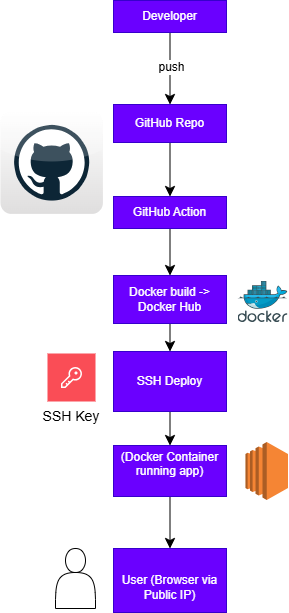
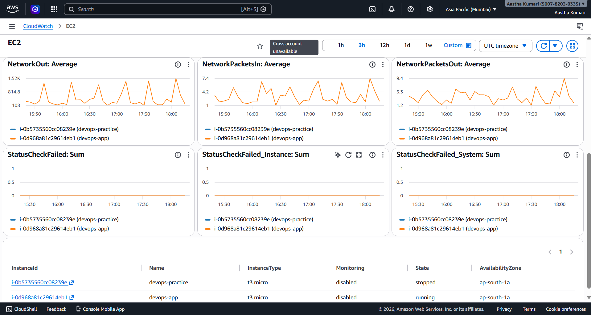
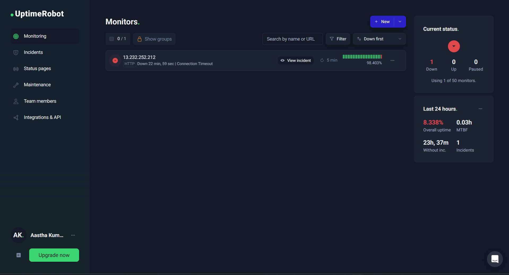

# 🚀 DevOps CI/CD Pipeline with Docker & GitHub Actions

!\[CI](https://github.com/aasthakumarii/devops-cicd-aws/actions/workflows/ci.yml/badge.svg)

This project demonstrates a complete **CI/CD pipeline with automated deployment** using **GitHub Actions, Docker, and AWS EC2**.

It covers the full lifecycle: **code → test → build → deploy → monitor**.

---

## 🎥 Demo

Watch the full CI/CD pipeline in action:

https://youtu.be/PDV7gp-cA7E

This demo shows:

- Code push to GitHub
- GitHub Actions pipeline execution
- Docker image build & push
- Automatic deployment to AWS EC2
- Live application update

---

## 📌 Features

- ✅ Automated CI/CD pipeline on every push
- 🧪 Unit testing using Jest
- 🐳 Docker image build & push to Docker Hub
- 🚀 Automatic deployment to AWS EC2 via SSH
- 🔄 Zero-downtime container redeployment
- 🔐 Secure credentials using GitHub Secrets
- ☁️ Cloud deployment on AWS EC2
- 📊 Monitoring with CloudWatch & UptimeRobot
- 📦 S3 artifact storage

---

## 🏗️ Architecture Diagram



---

## ⚙️ Tech Stack

- **Backend:** Node.js, Express
- **Testing:** Jest
- **CI/CD:** GitHub Actions
- **Containerization:** Docker
- **Cloud:** AWS EC2, AWS S3
- **Monitoring:** CloudWatch, UptimeRobot
- **Version Control:** Git & GitHub

---

## 🔁 CI/CD Pipeline Flow

## Code Push → GitHub Actions → Install Dependencies → Run Tests → Build Docker Image → Push to Docker Hub → Deploy to EC2 → Live Application

## 🚀 Live Deployment

⚠️ The EC2 instance may be stopped to avoid unnecessary costs.  
The application can be redeployed anytime using the CI/CD pipeline.

---

## 🐳 Docker Usage

```bash
docker build -t aasthakumarii/devops-app .
docker run -d -p 3000:3000 aasthakumarii/devops-app
```

---

## ☁️ AWS Deployment

EC2 (Ubuntu)
Docker installed
Port 80 exposed
Auto-deploy via GitHub Actions (SSH)

---

## 📊 Monitoring

### CPU Utilization (CloudWatch)


CloudWatch → CPU alerts

### Uptime Monitoring


UptimeRobot → uptime checks (5 min)

---

## 🔐 GitHub Secrets

DOCKER_USERNAME
DOCKER_PASSWORD
EC2_HOST
EC2_USER
EC2_KEY

---

## 🧪 Run Locally

```bash
git clone https://github.com/aasthakumarii/devops-cicd-aws.git
cd devops-cicd-aws
npm install
npm test
node app.js
```

---

## 🧠 Key Learnings

Built end-to-end CI/CD pipeline
Automated Docker-based deployment
Worked with AWS EC2 and S3
Implemented monitoring and alerts
Debugged real-world DevOps issues

---

## 👩‍💻 Author

Aastha Kumari

⭐ Support

If you found this project useful, give it a ⭐ on GitHub!
